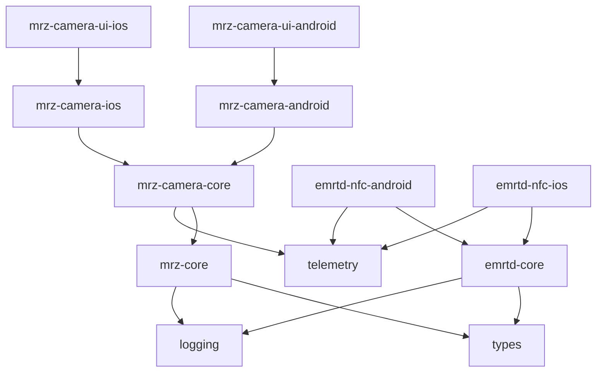

# Architecture

This document describes the structural shape of the project: how it is organized, what its parts are, how those parts relate, and what technology choices underpin them. It is the practical companion to the principles document. Where principles describe *what we value*, this document describes *how we organize the code to live up to those values*.

This document is living. As the project evolves, the architecture will evolve with it. Significant changes are recorded in dedicated decision records; this document captures the current state.

The architecture is target-agnostic by design. Specific platforms (mobile, desktop, backend, web) are implementation targets, not architectural assumptions. The shared logic, modular boundaries, and public API contracts apply uniformly regardless of where the SDK runs.

---

## High-Level Shape

The project is structured in three concentric layers:

- **Core logic layer** — platform-independent code: parsing, validation, generation, protocol logic, lookup tables, shared types. This layer compiles for any target the project supports and contains no I/O, no UI, and no platform APIs.
- **Platform I/O layer** — platform-specific code that bridges core logic to real-world inputs: camera frames, NFC tags, file system, network. Each module in this layer targets a specific platform.
- **Optional UI layer** — platform-native user interface components that wrap the I/O layer for consumers who want a complete out-of-the-box experience. Entirely optional; consumers who provide their own UI can ignore this layer.

Consumers can integrate at any layer. A backend service uses only core logic. A mobile application providing its own UI uses core + I/O. A mobile application wanting the fastest path to a working integration uses all three. The layering is not a usage requirement — it is a structural commitment.

---

## Root Namespace

All Kotlin code in this project lives under the root namespace **`io.lightine.tessera`**. Modules occupy sub-namespaces beneath this root (for example, the MRZ parser lives under `io.lightine.tessera.mrz.parsing`). The root namespace appears in every Kotlin source file's `package` declaration and in the project's Gradle group identifier.

This namespace is fixed. Sub-package structure beneath the root (the next level down, organizing parsing vs. generation vs. validation, etc.) emerges as code is written and can be refactored within modules without consumer impact.

---

## Module List

The project is composed of the following modules. The names below are the Gradle project names; the published Maven Central artifactId prefixes each name with `tessera-` (e.g., `mrz-core` → `tessera-mrz-core`) per [ADR-016](decisions/0016-maven-coordinates-and-first-publish.md). The full coordinate is `io.lightine.tessera:tessera-<module>:<version>`.

### Core Logic Modules

These modules are platform-independent. They are written in shared code and compile for every target the project supports.

**`mrz-core`**
Pure logic for the Machine Readable Zone: parsing, generation, validation, transliteration, format detection, and the manual-input package (validation of manually entered keying material such as document number, date of birth, and expiry date). Includes country code lookup tables, document type code tables, check digit algorithms, and per-country transliteration profiles.

**`emrtd-core`**
Pure logic for electronic document data: parsing of data groups (DG1, DG2, DG11, DG12, etc.), structural parsing of the Security Object (SOD), Logical Data Structure (LDS) layout, ASN.1 utilities, and the key derivation logic for chip access protocols (BAC and PACE). This module does not perform NFC I/O — it operates on raw bytes provided by the I/O layer.

**`types`**
Shared types and vocabulary used across modules: format enumerations (`MrzFormat`), categorical enumerations (`Sex`, `DocumentCategory`, `CountryCodeCategory`), shared field identifiers (`MrzField`), error taxonomy sealed roots (`MrzError`, `MrzValidationError`, `MrzWarning`), and common data structures with no runtime data dependency. Value classes whose contract requires consulting a lookup table (notably `CountryCode` and `DocumentType`) live with their tables in `mrz-core`, not here — see ADR-012. This module depends on nothing else and is depended on by everything. Its API surface is deliberately small. Discipline boundary: types only — if non-type shared code is ever needed, it goes in a separate module, not here.

### Platform I/O Modules

These modules bridge core logic to platform-specific inputs and outputs. Each is implemented separately per target platform; their public contracts are aligned so consumers see a consistent shape across platforms.

**`mrz-camera-core` + `mrz-camera-{platform}`**
Camera frame analysis, split across a platform-agnostic core and thin per-platform I/O modules ([ADR-021](decisions/0021-shared-mrz-camera-core-module.md)). **`mrz-camera-core`** holds the whole platform-agnostic contract: the **analyse-frame** API (frame in → result out) built on a generic OCR seam (`MrzTextRecognizer<F>`) — the deliberate extension point that keeps the parsing pipeline platform-agnostic and lets any frame source feed it (per [ADR-020](decisions/0020-camera-reading-architecture.md)) — plus the streaming **owns-the-camera-session convenience** (`MrzCameraScanner`) layered on a frame-source-agnostic `scan(Flow)` engine, so the same contract drives a CameraX stream, an AVFoundation stream, or any other frame source. It carries **no platform camera dependency**, passes candidate strings to `mrz-core` for parsing, depends on `mrz-core`, `telemetry`, and `types`, and is the first real `telemetry` emitter. The **`mrz-camera-{platform}`** modules are thin I/O layers on top of it: each receives camera frames from a platform-specific source, performs OCR with the platform's text-recognition framework, and runs the camera session, by implementing the OCR seam and the scanner for its frame type — so a new frame source is added without changing the core. As of `0.2.0`, **`mrz-camera-core` and `mrz-camera-android` exist** (the latter with the bundled ML Kit recognizer and the owns-the-camera-session scanner `CameraXMrzScanner`, CameraX `ImageAnalysis` + `bindToLifecycle`); **`mrz-camera-ios`** (AVFoundation + Apple Vision) mirrors the contract on the same core in the following slice.

**`emrtd-nfc-{platform}`**
NFC chip access: receives a platform-specific NFC tag handle, executes the BAC or PACE authentication protocol against the chip, reads requested data groups, and passes raw bytes to `emrtd-core` for parsing. Platform-specific implementations include `emrtd-nfc-android` and `emrtd-nfc-ios`.

### Optional UI Modules

These modules provide ready-made user interfaces for consumers who do not want to build their own. They are entirely optional and not depended on by any non-UI module.

**`mrz-camera-ui-{platform}`**
A native scanner UI for the camera reading flow: preview surface, scan region overlay, status feedback, error states, and result presentation. Built using the platform's native UI toolkit (Jetpack Compose for Android, SwiftUI with UIKit interop for iOS). Wraps the corresponding `mrz-camera-{platform}` module.

### Cross-Cutting Modules

These modules provide infrastructure used by all other modules.

**`telemetry`**
A pluggable telemetry interface. Defines the contract that consumers may implement to receive diagnostic information about SDK operation. Provides a default no-op implementation. Provides utilities for redaction to prevent accidental inclusion of sensitive data. The SDK has no built-in telemetry destination; consumers wire in their own.

**`logging`**
Internal logging utilities used by the SDK itself. Compile-time configurable log level. Built-in redaction for sensitive content. Connects to platform-appropriate logging facilities at the I/O layer (for example, system logs on the host platform). Distinct from `telemetry` because logging is for SDK internals; telemetry is for consumer-observable events.

---

## Dependency Graph

Module dependencies form a directed acyclic graph. Higher-level modules depend on lower-level modules; the reverse never holds.

Properties of the graph:

- **No cycles.** Anywhere a reader starts, the path flows toward `types`, `telemetry`, or `logging`.
- **`types` is the foundation.** It depends on nothing else and provides shared vocabulary used by everything that handles document data.
- **`mrz-core` and `emrtd-core` are independent.** A consumer can use either without the other. They communicate, when needed, through types defined in `types`.
- **Platform I/O modules depend on core, never the reverse.** Pure logic stays pure.
- **UI modules are leaves.** Nothing depends on them; they are entirely optional.
- **Cross-cutting modules** (`telemetry`, `logging`) sit at the bottom of the graph. They are infrastructure for the others.

---

## Layer Boundaries

A clear boundary between layers is what makes the architecture stable. The boundary is drawn at the data, not the code.

**Core logic** operates on plain data: byte arrays, strings, numbers, structured types defined in `types`. It has no awareness of where data comes from or where it goes.

**Platform I/O** translates between platform-specific objects (camera frames, NFC tags, file handles) and the plain data that core logic consumes. It is responsible for everything that involves the operating system, hardware, or external services.

**Optional UI** consumes platform I/O modules to produce user-facing experiences. It depends on platform UI toolkits and follows native conventions. The UI layer never accesses core logic directly; it goes through the I/O layer.

This boundary is what allows core logic to be reused across targets. The same `mrz-core` parsing code runs on a phone, a server, and a web browser without modification. Only the layers above it differ.

---

## Technology Choices

### Kotlin Multiplatform for Shared Logic

Core logic modules are implemented in Kotlin and compiled to multiple targets through Kotlin Multiplatform. This includes Android (JVM bytecode), iOS (Kotlin/Native), and other targets the project may add later (JVM for backend, JS/Wasm for web, native for desktop).

Rationale: the core logic is genuinely platform-independent. Maintaining a single source of truth for parsing, validation, and protocol implementation is more important than perfect platform-native idiom in code that consumers do not interact with directly. Bug fixes and specification updates apply to every target simultaneously, eliminating drift.

### Native UI per Platform

User interface components in optional UI modules are written using each platform's native UI toolkit:

- **Android** uses Jetpack Compose, the platform's modern declarative UI framework.
- **iOS** uses SwiftUI, with UIKit interoperability where required for older OS versions or specific component needs.

Rationale: the SDK's UI components are embedded inside consumer applications. Native UI inherits the host application's theming, accessibility settings, dynamic type, and platform conventions automatically. Cross-platform UI frameworks introduce a foreign rendering model that does not blend cleanly into a native host. The volume of UI code is small enough that duplication across platforms is an acceptable cost in exchange for proper native integration.

### Native I/O per Platform

Platform I/O modules use the operating system's native APIs directly:

- **Camera input** uses CameraX on Android and AVFoundation on iOS.
- **OCR** uses ML Kit Text Recognition on Android and Apple Vision (`VNRecognizeTextRequest`) on iOS.
- **NFC** uses Android's NFC framework (`IsoDep`) and iOS's Core NFC (`NFCISO7816Tag`).

Rationale: these APIs are platform-specific by nature. Wrapping them in a cross-platform abstraction would add complexity without benefit. The shared contract is at the *output* level — what data the I/O layer produces — not at the API call level.

### Cryptographic Primitives via Platform APIs

Where the SDK performs cryptographic operations (BAC/PACE key derivation, hash computation, signature handling), it uses platform-appropriate APIs that leverage hardware acceleration where available. Hardware-backed key storage, when applicable to a feature, uses the platform's secure element APIs (StrongBox or Keystore on Android, Secure Enclave on iOS).

---

## Naming and Structure

Module naming, package structure, public API boundaries, and the error taxonomy follow the conventions documented in `conventions.md`. The architecture defines *what* modules exist and how they depend on each other; the conventions document defines *how* they are named and structured.

---

## What Is Deliberately Out of Scope

Some architectural choices were considered and not adopted. Recording them here prevents revisiting the same questions and explains the project's shape.

**Compose Multiplatform for UI.** Considered for sharing UI code across platforms. Not adopted because the SDK's UI runs inside consumer applications, where native rendering blends with the host application's design and a non-native rendering layer feels foreign. The volume of UI code is small enough that duplication is acceptable.

**A monolithic facade module.** Considered as a convenience entry point that bundles all features behind one API. Not adopted because it would hide the modular structure, encourage black-box usage, and create a single dependency that consumers must include even when they need only one feature.

**Cross-platform crypto via a shared library.** Considered for unifying cryptographic operations across platforms. Not adopted in favor of using each platform's native crypto APIs, which provide better hardware acceleration, integrate with platform key storage, and avoid maintaining a separate cryptographic implementation.

**Bundled telemetry destination.** Considered for offering an out-of-the-box analytics experience. Not adopted because the SDK does not phone home; telemetry is plugged in by the consumer through the `telemetry` interface.

**Separate module for manual document data input.** Considered as `document-input-core`. Not adopted; the functionality lives as an internal package inside `mrz-core` per Principle 11. It can be promoted to a standalone module if independent reuse, evolution, or shipping becomes justified.

---

## Future-Aware Boundaries

Several capabilities are planned for future versions. The current architecture is shaped to make adding them non-breaking.

**Backend, desktop, and web targets** can be added by introducing new platform I/O modules that target the respective environments. Core logic modules already compile for these targets; only the I/O bridge needs to be written.

**Verifiable Credentials and wallet capabilities** will arrive as new modules at the appropriate layer. The current architecture does not include them, but the modular structure accommodates them when they are added. Their dependencies will fit naturally into the existing graph.

**Cryptographic verification of chips** (signature checking against trust anchors, certificate path validation) is a natural extension of `emrtd-core`. It can be implemented as an internal package or promoted to a standalone module depending on how it evolves.

**Selfie capture and comparison** is planned as an entirely separate set of modules layered on top of the existing structure. It does not affect any current module.

**Access-controlled session management** for sensitive operations is designed to be added as a new top-level module that wraps existing modules. The current public APIs remain stable when this is introduced.

---

## How This Document Relates to Principles

This architecture is a direct expression of the project's principles (defined in `principles.md`):

- **Principle 3 (Modular)** is what produces the module list and dependency graph.
- **Principle 8 (Native fit)** is what splits shared logic from platform-specific code.
- **Principle 11 (Internal packages first)** is what keeps the module count grounded in real need rather than structural preference.
- **Principle 5 (Transparency)** is what makes the public API surface broad enough that consumers can reach any data the SDK extracts.
- **Principle 9 (Forward-compatible)** is what keeps the architecture stable as the project grows.

When future architectural choices arise, the principles are the lens for resolving them. When this document conflicts with a principle, the principle wins and this document is updated.
